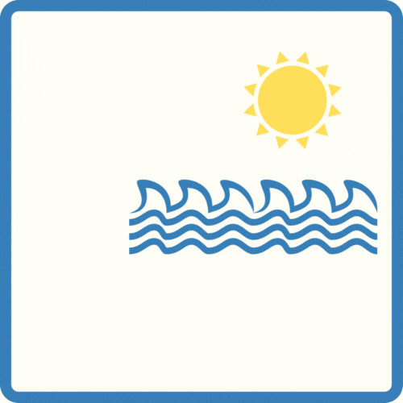

# SEA SCAPE

## [To Web App](https://seascape.adaptable.app)



## Description

Sea Scape is a web app where users explore and rate beaches. They can search by region or browse a comprehensive list. Administrators manage the database, editing, deleting, or adding beaches as needed. Administrators also see the comments of the users and have the rights to delete them.

## User stories

- **404** - User can see a nice 404 page when goes to a page that doesn’t exist so that they know it was their fault.
- **500** - User can see a nice error page when the team screws it up so that they know that is not their fault.
- **Login-signup** - There is a welcome page that gives the option to either log in as an existing user, or sign up with a new account.
- **Add-signup** - Also new users can sign up with full information so that they can have access to the page.
- **Homepage** - Users can see a carrousel of images on the home page.
- **Beach-search** - Users can explore beaches by region or view a comprehensive list of available beaches.
- **Beach-details** - Upon selecting a specific beach, users can view detailed information including reviews, ratings, and general descriptions. Additionally, they can access administrative controls to edit or delete their comments.
- **Administrative-controls** - Administrators have exclusive rights to manage the beach database. They can edit or delete existing beach entries, create new ones, and moderate user comments to maintain a positive community environment.

## API routes (back-end)

- GET /user/signup
  - renders signup.hbs
- POST /user/signup
   - body:
    - username
    - email
    - password
    - errMessage if any of the fields is empty or doesn't meet the requirements
- GET /user/login 
  - renders login.hbs   
- POST /user/login
  - redirect to /content 
  - body:
    - email
    - password
    - errMessage if any of the fields is empty or doesn't meet the requirements
- GET /content
    - renders content/main-page.hbs
- GET /content/all
  - renders content/all-beach.hbs
  - includes the list of beaches displayed in cards
  - redirects to /content/:id/beachInfo if user presses one card 
- GET /content/allRegion
  - renders content/region.hbs
  - redirects to content/:region/beachRegion if user presses one region
- GET /content/:id/beachInfo
  - body:
    - name
    - region
    - description
    - rating
    - comments
- GET /content/profile/:id
  - renders content/user-profile.hbs
  - List of all your comments
# Admin Routes:
- GET /admin
  - renders admin/create-form.hbs
- POST /admin
   - redirects to /content if admin completes the form 
   - create a new beach
  - body:
    - name
    - region
    - description
    - localtion
    - accessibility
    - entertainment
    - upload photo
- GET /edit/:id
    - renders to admin/edit-form.hbs
- Post /edit/:id
  - updates the info of each beach
  - redirects to /content/${req.params.id}/beachInfo
- POST /admin/delete/:id
  - deletes the beach
  - redirects to /content/all once deleted

## Models

User Model

```
   username: {
     type: String,
     trim: true,
     required: false,
     unique: true,
   },
   email: {
     type: String,
     required: true,
     unique: true,
     lowercase: true,
     trim: true,
   },
   password: {
     type: String,
     required: true,
   },
   role: {
     type: String,
     enum: ["user", "admin"],
     default: "user",
   },
     profilePic: String
```

Beach Model 
```
  name: {
  type: String,
  require: true,
  },
  region: {
  type: String,
  require: true,
  enum: [
  "Andalucía",
  "Principado de Asturias",
  "Baleares",
  "Canarias",
  "Cantabria",
  "Cataluña",
  "Comunidad Valenciana",
  "Extremadura",
  "Galicia",
  "Comunidad de Madrid",
  "Región de Murcia",
  "País Vasco",
  "Ciudad Autónoma de Ceuta",
  "Ciudad Autónoma de Melilla",
  ],
  },
  description: {
  type: String,
  require: true,
  },
  location: {
  type: [Number],
  require: true,
  },
  difficultyAccess: {
  type: String,
  enum: ["Low", "Medium", "High"],
  required: true,
  },
  entertainment: {
  type: [String],
  enum: ["Surf", "Nudism", "Diving", "Kayak", ""],
  },
  beachPic: String
```
Comment Model
```
    comment: {
    type: String,
    required: true,
    },
    user: {
    type: mongoose.Schema.Types.ObjectId,
    ref: "User",
    },
    beach: {
    type: mongoose.Schema.Types.ObjectId,
    ref: "Beach",
    }
```
Rating Model 
```
    rating: {
    type: Number,
    default: 0,
    },
    user: {
    type: mongoose.Schema.Types.ObjectId,
    ref: "User",
    },
    beach: {
    type: mongoose.Schema.Types.ObjectId,
    ref: "Beach",
    }
```

## Backlog

- Favorite Beaches:
  - Add a functionality so users can like their favorites beaches and add it to their profile.

- Nodemailer:
  - Add nodemailer so the user recives a notification once their are logged in.

- Search Functionality: 
  - Allow users to search for beaches by name, activities, or specific region.

- Weather API:
  - Provide current and forecasted weather conditions for each beach location.

- Photo Gallery: 
  - Allow users to upload photos to the comments.

- Mobile friendly interface:
  - Make it responsive to all screen sizes.

# Links

### Collaborators

[Abraham Casiello](https://github.com/Abranucu)

[Alicia Urdiales](https://github.com/aliciaurds)

### Sketch

[Link](https://excalidraw.com/#room=7a5a6f82b2f6f52d18bf,3uYNMui4c3tG9ABnmBKrSQ)

### Slides

[Link](./public/images/sea-scape-presentation.pdf)

## Deploy

[Link](https://seascape.adaptable.app/)
